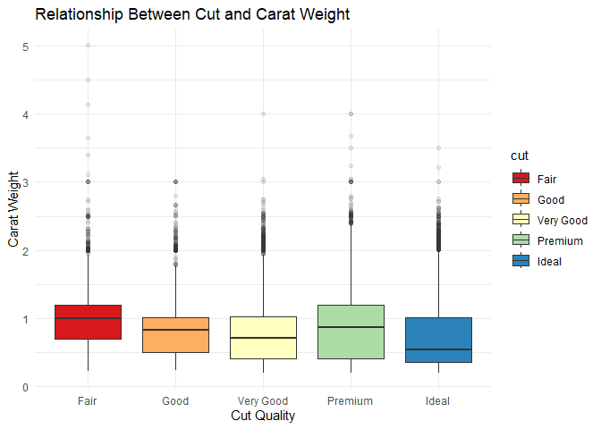
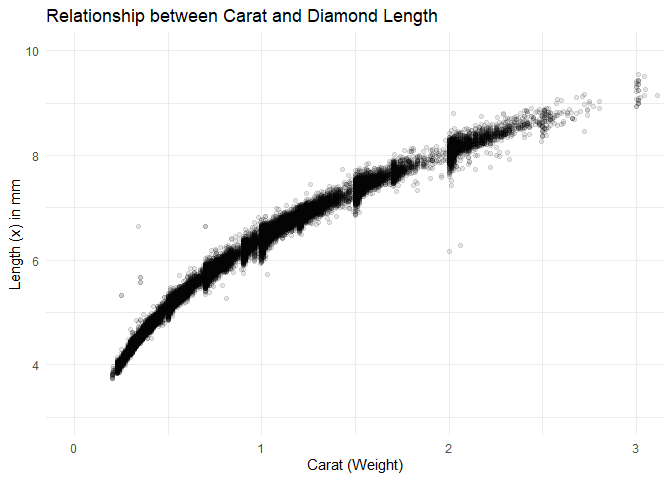

FA1_Lecture2
================
Emmanuel Fe Benito
2026-02-01

# 7.1

``` r
ggplot(data = diamonds) +
  geom_point(mapping = aes(x = carat, y = price, color = cut))
```

<!-- -->

### Analysis

It suggests that a carat’s weight has a negative correlation with the
cut’s quality as many of the high quality cuts are concentrated on the
lower carat weights whilst the fair cuts, for example, are more
scattered about and can be seen across the carat weights.

## Visual

``` r
ggplot(diamonds, aes(x = cut, y = carat, fill = cut)) +
  geom_boxplot(outlier.alpha = 0.1) +
  labs(
    title = "Relationship Between Cut and Carat Weight",
    x = "Cut Quality",
    y = "Carat Weight",
  ) +
  theme_minimal() +
  scale_fill_brewer(palette = "Spectral")
```

<!-- -->

### Conclusion

From the new visual plot we can conclude that the more higher quality
cuts tend to way much less than the lower quality cuts, with the fair
cuts having outliers that reach much farther than others. From this we
can solve the paradox in the other plot, that being that a carat’s
weight becomes a factor in its pricing. While a higher quality cut is
decently expensive its also much smaller and lighter whereas a fair
quality cut is much heavier and bigger, this aspect then becomes the
reason why the pricing of a fair cut is about the same as the higher
quality cuts. A higher quality cuts has more value per gram but a fair
quality cut simply has enough grams to even out.

# 7.2

``` r
ggplot(data = diamonds, mapping = aes(x = carat, y = x)) +
  geom_point(alpha = 0.1) +
  coord_cartesian(xlim = c(0, 3), ylim = c(3, 10)) +
  labs(
    title = "Relationship between Carat and Diamond Length",
    x = "Carat (Weight)",
    y = "Length (x) in mm"
  ) +
  theme_minimal()
```

<!-- -->

### Analysis

The plot suggest that as the carat weight increases the length of the
diamonds consequently increases as well. A diamond is often cut with
specific shapes in mind and with specific ratios as such when a
diamond’s weight increases or decreases there is a specific length in
mind when cutting it, this in order to achieve a desired quality. This
also explains how there is little to no outliers.
